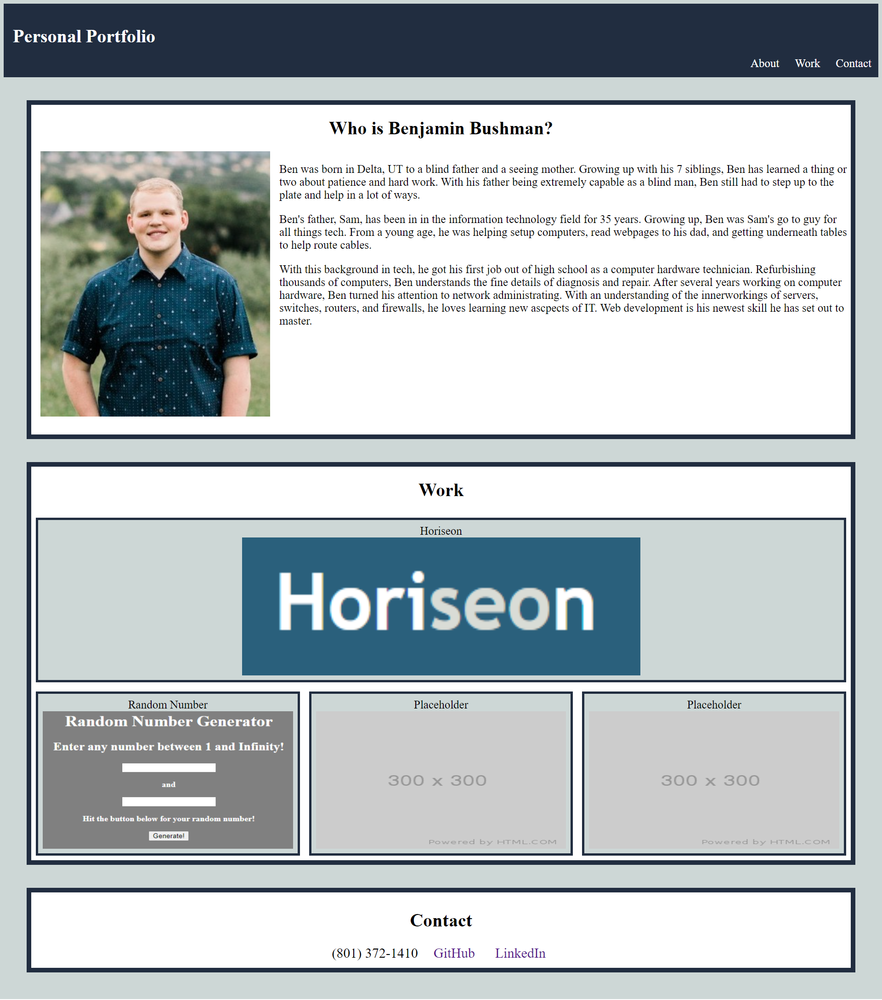

# Description
Take a look at my personal portfolio for some information about my personal life as well as my work projects. In this repository, you will find the my code used to create and style this website. From flexbox and mediaquaries to semantic elements, you are sure to find my understanding of HTML and CSS.

  

# Screenshot

  

# Website URL
https://benbushman98.github.io/Personal-Portfolio/
